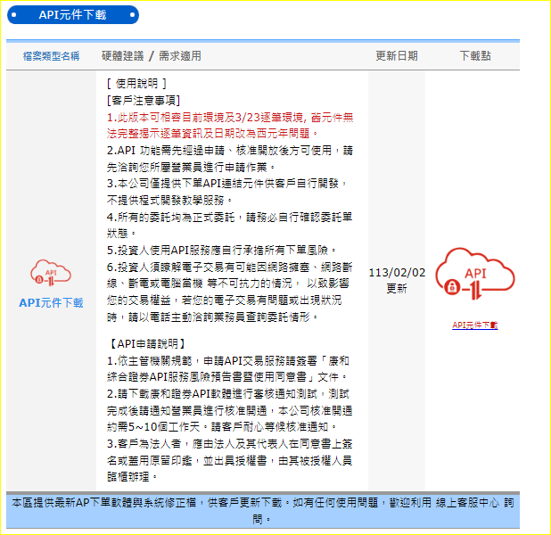
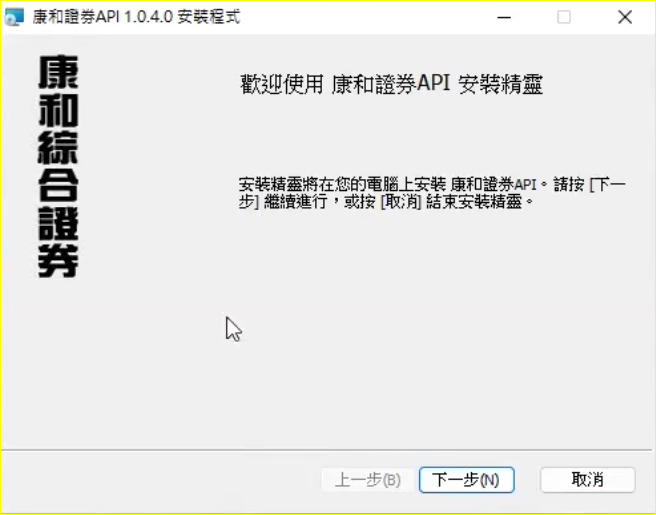
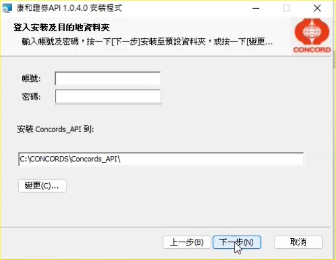
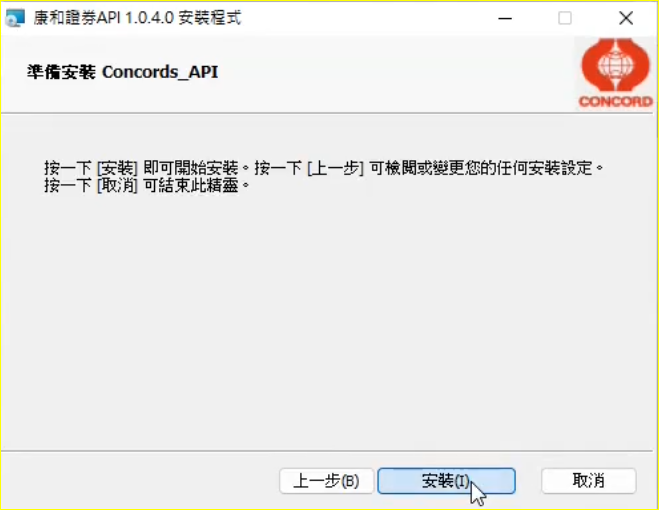
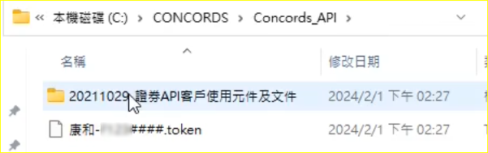

# 康和證券 API 測試操作說明
1. 請客戶至網頁下載API安裝程式  

2. 下載 <strong>ConcordsSapiSetup.zip</strong> , 後解壓縮為 <strong>ConcordsSapiSetup.msi</strong> , 執行安裝程式。  
3. 頁面(3之1)  

3. 頁面(3之2)  
輸入電子帳號密碼, 要有憑證進行雙因子認證  

3. 頁面(3之3)  

4. 安裝完成後  
產生Token, 可做匯入    
